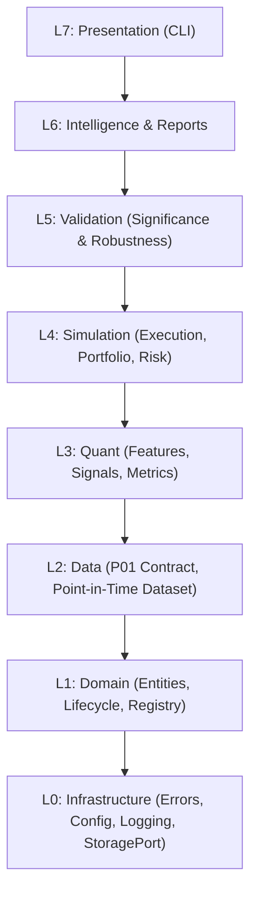

# QRSIP — Quantitative Research & Strategy Intelligence Platform

> **Project Status:** `IN PROGRESS / NOT COMPLETE` (Alpha stage)
>
> **Development Phase:** Phases 0–7 implemented; final environment acceptance verification pending.
>
> **Test Suite:** 352 automated tests passing in the repository environment.
>
> *Notice: QRSIP is not production-ready and is not yet verified for live portfolio management. The current verification is local; a clean-container acceptance run and CI execution remain outstanding.*

---

## 1. What QRSIP Is

**QRSIP** (Quantitative Research & Strategy Intelligence Platform — Project P02) is a research-grade, deterministic, and auditable Python system designed to transform quantitative trading hypotheses into verified, bias-tested trading strategies.

It provides the computational and validation scaffolding that sits between raw historical market data infrastructure and future live execution systems:

$$\text{Research Question} \longrightarrow \text{Hypothesis} \longrightarrow \text{Strategy Spec} \longrightarrow \text{Point-in-Time Data} \longrightarrow \text{Simulation} \longrightarrow \text{Validation} \longrightarrow \text{Research Report} \longrightarrow \text{Human Decision}$$

### What This Is Not
* **Not a toy tutorial backtester**: It does not make unrealistic assumptions like perfect fills, zero commissions, or instant zero-latency executions.
* **Not an ad-hoc Jupyter notebook collection**: Experiments are reproducible entities with immutable configs, dataset manifests, and seeds.
* **Not a live broker execution engine**: Live trading is strictly out of scope (reserved for downstream platforms).
* **Not a dashboard UI**: Unaudited visual dashboards are deliberately excluded in favor of auditable, versioned research reports.

---

## 2. Why It Exists

Most quantitative strategy failures originate from subtle research methodological errors:
1. **Look-ahead bias**: Strategy logic observing information before it was officially published or closed.
2. **Unrealistic fill assumptions**: Assuming market orders fill at the decision bar's close price or at zero spread/cost.
3. **Broken accounting**: Fabricating cash or valuing unmarked positions without fail-closed accounting identities.
4. **Data leakage & p-hacking**: Running multiple parameter variations and selecting optimal outcomes without multiple-testing penalties (such as Deflated Sharpe Ratios).
5. **Irreproducibility**: Inability to rerun a historical backtest and obtain bit-for-bit identical results due to untracked environment dependencies or random seeds.

QRSIP exists to enforce mathematical and software engineering rigor to eliminate these failure modes structurally.

---

## 3. Core Architectural Principles

* **Fail-Closed by Design**: If required data, configuration, marks, or validation rules are missing or ambiguous, the system raises an explicit `QRSIPError` with actionable structured context. It never guesses or fabricates prices.
* **Point-in-Time Safety**: Strict causality is enforced at the data layer. Decisions at timestamp $T$ can only view market data up to $T$.
* **Deterministic Execution**: Given the same dataset, configuration, and random seed, simulation outputs are bit-for-bit identical.
* **Explicit Cost & Slippage Modeling**: Commissions (basis points and fixed fees) and slippage penalties are explicitly applied to fills.
* **Verified Accounting Invariants**: Every cash movement and fill is accounted for via double-entry arithmetic.
* **Separation of Concerns**: Strategy logic never touches disk storage, network sockets, or presentation interfaces.
* **Human-in-the-Loop Promotion**: Machine-automated pipelines can reject candidate strategies, but promotion to production candidacy requires explicit human sign-off (`PromotionDecision`).

---

## 4. Architecture & Layer Model

The system follows a strict downward-only dependency model across 8 conceptual layers:



| Layer | Responsibility | Primary Modules | Implementation Status |
|---|---|---|---|
| **L0 Infrastructure** | Base exceptions, YAML configuration, structured logging, system health checks, portable file storage | `errors.py`, `config.py`, `logging.py`, `doctor.py`, `infrastructure/storage.py` | **Implemented & locally tested** |
| **L1 Domain** | Research entities, 12-state research lifecycle state machine, append-only entity registry | `domain/base.py`, `domain/entities.py`, `domain/lifecycle.py`, `domain/registry.py`, `domain/results.py` | **Implemented & locally tested** |
| **L2 Data** | P01 boundary, bar validation, point-in-time views, deterministic fixtures, checksum-bound Parquet adapter | `data/contract.py`, `data/validation.py`, `data/dataset.py`, `data/fixtures.py`, `data/parquet.py` | **Implemented & locally tested** |
| **L3 Quant** | Causal feature calculation, signal strategy protocols, fail-closed financial metrics | `quant/features.py`, `quant/signals.py`, `quant/metrics.py` | **Implemented & locally tested** |
| **L4 Simulation** | Order models, deterministic next-bar fill simulator, portfolio accounting, risk engine, event loop | `simulation/execution.py`, `simulation/portfolio.py`, `simulation/risk.py`, `simulation/engine.py` | **Implemented & locally tested** |
| **L5 Validation** | Significance math, Deflated Sharpe Ratio, bias checks, multiple testing, sensitivity, walk-forward evidence | `validation/` | **Implemented & locally tested** |
| **L6 Intelligence** | Research artifacts, lineage joins, deterministic Markdown/JSON reports, reproduction | `intelligence.py`, `domain/results.py` | **Implemented & locally tested** |
| **L7 Presentation** | Research CLI: experiment run/rerun, report show, human promotion decision | `cli.py` | **Implemented & locally tested** |

---

## 5. P01 $\to$ P02 Relationship & Data Boundary

QRSIP (P02) does **not** ingest raw vendor data, clean messy exchange feeds, or manage real-time websocket connections. That responsibility belongs strictly to upstream market data infrastructure (**P01**).

* P02 consumes market data exclusively through the [`P01DataContract`](file:///home/mrcn2/quant-research-strategy-intelligence-platform/src/qrsip/data/contract.py) protocol.
* Data is exchanged as validated, ordered sequences of [`Bar`](file:///home/mrcn2/quant-research-strategy-intelligence-platform/src/qrsip/data/contract.py) records, where `timestamp` represents the UTC **close** of the bar.
* For standalone testing and development without a live P01 instance, P02 provides deterministic fixtures via [`FixtureP01Provider`](file:///home/mrcn2/quant-research-strategy-intelligence-platform/src/qrsip/data/fixtures.py), explicitly labeled as test fixtures (ADR-0007).

---

## 6. Point-in-Time Safety (Zero Look-Ahead Bias)

To prevent look-ahead bias, strategy code never interacts with raw bar arrays or future data slices. All data access must pass through [`PointInTimeView`](file:///home/mrcn2/quant-research-strategy-intelligence-platform/src/qrsip/data/dataset.py):

* A bar with closing timestamp $T$ becomes visible to the strategy **only** when `as_of >= T`.
* Any query or indexing operation attempting to inspect bars with timestamps $> T$ immediately raises a fail-closed [`LookAheadError`](file:///home/mrcn2/quant-research-strategy-intelligence-platform/src/qrsip/data/dataset.py).
* Causal feature calculations ([`features.py`](file:///home/mrcn2/quant-research-strategy-intelligence-platform/src/qrsip/quant/features.py)) require explicit warm-up periods and return `None` during warm-up rather than backfilling from future data.

---

## 7. Deterministic Execution Model (ADR-0005)

To guarantee realism, QRSIP adheres to an explicit timing convention:

1. **Signal Decision**: At the **close** of bar $T$ (`decision_time = T`), strategy logic evaluates available data and issues a target order.
2. **Order Execution**: Market orders fill at the **open of the subsequent bar** $T+1$ (`fill_time > decision_time`). Same-bar close execution is strictly forbidden.
3. **Explicit Cost Model**:
   * **Commissions**: Calculated as basis points of traded value plus an optional fixed fee per fill.
   * **Slippage**: Applied as an adverse basis-point penalty embedded directly into the execution price (buyers pay more; sellers receive less).

---

## 8. Portfolio Accounting & Invariants (spec §25)

Simulation accounting is cash-first and double-entry ([`portfolio.py`](file:///home/mrcn2/quant-research-strategy-intelligence-platform/src/qrsip/simulation/portfolio.py)):

* **Verified Equity Identity**:
  $$\text{equity} = \text{initial\_cash} + \text{realized\_pnl} + \text{unrealized\_pnl} - \text{commissions}$$
* **No Unmarked Valuation**: Every open position must have a verifiable current market price. If a mark is missing, valuation fails closed with [`PortfolioError`](file:///home/mrcn2/quant-research-strategy-intelligence-platform/src/qrsip/errors.py) rather than defaulting to cost basis.
* **Cash Solvency**: Purchases exceeding available cash are rejected rather than allowing negative cash balances.

---

## 9. Current Testing Evidence

The platform currently includes **352 passing automated tests** in the repository environment:

```bash
$ .venv/bin/pytest -q
350 passed
```

Test tiers currently contain 338 unit tests, 3 contract tests, 2 property tests, 4 adversarial tests, 2 integration tests, 1 acceptance test, and 2 regression tests.

* **Static analysis:** `ruff check src tests`, `ruff format --check src tests`, and `mypy src` pass.
* **Security:** `bandit -r src -c pyproject.toml -ll` reports no medium/high issues.
* **CI:** Workflow files are present; execution of GitHub Actions has not been performed in this environment.

---

## 10. Current Implementation Status & Known Limitations

### Current Status
* **Phases 0–7 (L0 Infrastructure through L7 Presentation):** Implemented and locally tested.
* **Research workflow:** YAML experiment execution, canonical run artifacts, deterministic reruns, Markdown/JSON reports, and human promotion decisions are implemented.
* **Verification:** 350 tests pass locally; clean-container acceptance and CI execution remain outstanding.

### Known Limitations & Defects
* **Fresh-environment acceptance:** The repository acceptance test is executable, but a clean-container run has not been performed in this environment.
* **CI execution:** Workflow configuration exists, but GitHub Actions has not been executed from this environment.
* **Synthetic fixture default:** The local CLI workflow uses explicitly labeled deterministic fixtures; real P01 production data is an external dependency and is not represented by these fixtures.
* **PostgreSQL, FastAPI, AI copilot, Rust performance layer, dashboard, and live execution:** Deferred or explicitly excluded by the existing architecture and ADRs.

---

## 11. Remaining Engineering Work

The current in-scope implementation is locally verified. Remaining release verification is:
1. Run the acceptance workflow in a clean, reproducible environment.
2. Execute the configured CI workflows and record their result.
3. Replace the synthetic fixture dataset with the external, checksum-bound P01 production reference when that artifact is available.

The deferred systems listed above are not implementation defects for P02.

---

## 12. Local Development & Quick Start

### Prerequisites
* Python 3.11 or Python 3.12
* Git
* Make (optional, but recommended)

### Setup & Bootstrap

```bash
# Clone repository
git clone https://github.com/naresh-cn2/quant-research-strategy-intelligence-platform.git
cd quant-research-strategy-intelligence-platform

# Create and activate virtual environment
python3 -m venv .venv
source .venv/bin/activate

# Install package in editable mode with development dependencies
pip install -e ".[dev]"
```

### Running Health Checks & Status

```bash
# Run environment diagnostics
qrsip doctor

# View current operational project status
qrsip status
```

### Running Quality Checks & Tests

```bash
# Run the test suite
pytest

# Run linter
ruff check src tests

# Check code formatting
ruff format --check src tests

# Run strict type checking
mypy src

# Run security checks
bandit -r src -c pyproject.toml -ll
```

### Running the Research Workflow

```bash
# Run a fixture-backed experiment and persist canonical artifacts
qrsip experiment run --config configs/experiments/example.yaml --artifacts artifacts

# Re-run the recorded configuration and verify its canonical digest
qrsip experiment rerun --experiment-id EXAMPLE-FIXTURE-RESEARCH --config configs/experiments/example.yaml --artifacts artifacts

# Show the recorded Markdown or JSON report
qrsip report show --experiment-id EXAMPLE-FIXTURE-RESEARCH --artifacts artifacts
qrsip report show --experiment-id EXAMPLE-FIXTURE-RESEARCH --artifacts artifacts --format json

# Record a human decision; approval requires passing validation
qrsip promote --experiment-id EXAMPLE-FIXTURE-RESEARCH --decision REJECT --reviewer reviewer --rationale "Review required before any promotion" --artifacts artifacts
```

## 13. Project Maturity & License

* **Maturity**: Alpha (`Development Status :: 3 - Alpha`).
* **License**: Proprietary (licensing decision pending per ADR-0004).
