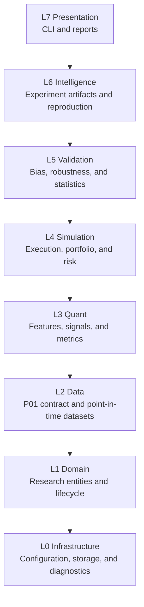

# QRSIP

## Quantitative Research & Strategy Intelligence Platform

[](https://www.python.org/)
[](https://docs.astral.sh/ruff/)
[](https://mypy-lang.org/)
[](.github/workflows/security.yml)

> **Project status:** Alpha-stage research platform. L0–L7 are implemented and locally verified; final external acceptance evidence remains incomplete. QRSIP is not a live trading system and makes no claim of production performance or profitability.

QRSIP is a Python research-software project for turning quantitative hypotheses into deterministic, auditable experiments. It combines point-in-time data access, explicit execution costs, portfolio accounting, risk controls, statistical validation, reproducibility artifacts, and a human-controlled promotion decision.

## Portfolio map

- [Project overview](docs/career/PROJECT_OVERVIEW.md)
- [Engineering case study](docs/career/CASE_STUDY.md)
- [Engineering skills matrix](docs/career/ENGINEERING_SKILLS.md)
- [Architecture overview](docs/architecture/overview.md)
- [Acceptance provenance matrix](docs/operations/acceptance_provenance_matrix.md)
- [Project status](PROJECT_STATUS.md)
- [Security policy](SECURITY.md)
- [Contributing guide](CONTRIBUTING.md)

## What problem does it solve?

Quantitative research results are easy to overstate when the experiment has hidden data leakage, perfect fills, omitted costs, broken accounting, missing risk controls, or no way to reproduce the original run. QRSIP makes those constraints explicit in code and tests.

The project supports this workflow:

```text
Research question
      ↓
Hypothesis and strategy specification
      ↓
Point-in-time dataset and data-quality checks
      ↓
Causal features and signals
      ↓
Deterministic simulation, costs, portfolio, and risk
      ↓
Validation and robustness evidence
      ↓
Research report and human decision
```

QRSIP does not ingest raw vendor data, connect to a broker, or represent synthetic fixtures as production data. It consumes data through the narrow P01 contract and keeps the external production-data boundary explicit.

## Architecture



Dependencies flow downward only. Higher layers orchestrate lower-layer contracts; they do not move financial calculations into the CLI or make domain objects depend on storage implementations. The boundary prevents presentation concerns, infrastructure details, and research logic from becoming coupled.

The detailed layer responsibilities and evidence links are in [`docs/architecture/overview.md`](docs/architecture/overview.md).

## Research and engineering controls

| Control | Implementation evidence |
|---|---|
| Point-in-time causality | `PointInTimeView` and `LookAheadError` in `src/qrsip/data/dataset.py` |
| Deterministic signal/fill timing | ADR-0005; decision at close T, fill at next open T+1 |
| Explicit costs | `CostModel` for commissions, fixed fees, and slippage |
| Accounting invariant | `Portfolio.assert_accounting_identity()` |
| Risk controls | `RiskEngine`, order limits, exposure limits, and drawdown halt |
| Dataset identity | Dataset descriptors, manifests, SHA-256 checksums, and row counts |
| Reproducibility | Resolved experiment configuration and canonical result digests |
| Research integrity | Bias checks, robustness evidence, explicit limitations, and no automatic promotion |
| Human control | `PromotionDecision` and `qrsip promote` require an explicit human decision |

These are implementation controls. They do not establish investment merit, production data quality, or live-trading performance.

## Current implementation evidence

The repository contains:

- 352 passing automated tests across unit, contract, property, adversarial, integration, acceptance, and regression suites.
- A local verification harness at `scripts/validation/run_checks.sh`.
- Ruff formatting and lint checks.
- Strict mypy checking.
- Bandit and pip-audit checks.
- Docker and Docker Compose definitions.
- GitHub Actions CI and Security workflows.
- Markdown and JSON research reports.
- Deterministic run and rerun artifacts.
- A human-controlled promotion gate.

The complete local evidence record is in [`PROJECT_STATUS.md`](PROJECT_STATUS.md) and [`reports/verification/`](reports/verification/).

---

## Detailed implementation

The implementation is organized so each concern has one enforcement point:

- **P01 → P02 data boundary** — P02 consumes validated bars through `P01DataContract`; fixtures are explicitly synthetic and the repository does not claim a canonical production dataset.
- **Point-in-time safety** — `PointInTimeView` exposes only observations available at its decision clock and raises `LookAheadError` for future reads.
- **Execution semantics** — decisions are made at close T and fills occur at the next bar open, with explicit commissions and slippage.
- **Accounting and risk** — portfolio state verifies cash/position identities and the risk engine enforces order, position, exposure, and drawdown controls.
- **Validation and reporting** — L5 produces immutable evidence and L6 writes deterministic Markdown/JSON artifacts that retain limitations and a human decision boundary.

QRSIP (P02) does **not** ingest raw vendor data, clean messy exchange feeds, or manage real-time websocket connections. That responsibility belongs strictly to upstream market data infrastructure (**P01**).

* P02 consumes market data exclusively through the [`P01DataContract`](src/qrsip/data/contract.py) protocol.
* Data is exchanged as validated, ordered sequences of [`Bar`](src/qrsip/data/contract.py) records, where `timestamp` represents the UTC **close** of the bar.
* For standalone testing and development without a live P01 instance, P02 provides deterministic fixtures via [`FixtureP01Provider`](src/qrsip/data/fixtures.py), explicitly labeled as test fixtures (ADR-0007).

---

## Point-in-Time Safety (Zero Look-Ahead Bias)

To prevent look-ahead bias, strategy code never interacts with raw bar arrays or future data slices. All data access must pass through [`PointInTimeView`](src/qrsip/data/dataset.py):

* A bar with closing timestamp $T$ becomes visible to the strategy **only** when `as_of >= T`.
* Any query or indexing operation attempting to inspect bars with timestamps $> T$ immediately raises a fail-closed [`LookAheadError`](src/qrsip/data/dataset.py).
* Causal feature calculations ([`features.py`](src/qrsip/quant/features.py)) require explicit warm-up periods and return `None` during warm-up rather than backfilling from future data.

---

## Deterministic Execution Model (ADR-0005)

To guarantee realism, QRSIP adheres to an explicit timing convention:

1. **Signal Decision**: At the **close** of bar $T$ (`decision_time = T`), strategy logic evaluates available data and issues a target order.
2. **Order Execution**: Market orders fill at the **open of the subsequent bar** $T+1$ (`fill_time > decision_time`). Same-bar close execution is strictly forbidden.
3. **Explicit Cost Model**:
   * **Commissions**: Calculated as basis points of traded value plus an optional fixed fee per fill.
   * **Slippage**: Applied as an adverse basis-point penalty embedded directly into the execution price (buyers pay more; sellers receive less).

---

## Portfolio Accounting & Invariants (spec §25)

Simulation accounting is cash-first and double-entry ([`portfolio.py`](src/qrsip/simulation/portfolio.py)):

* **Verified Equity Identity**:
  $$\text{equity} = \text{initial\_cash} + \text{realized\_pnl} + \text{unrealized\_pnl} - \text{commissions}$$
* **No Unmarked Valuation**: Every open position must have a verifiable current market price. If a mark is missing, valuation fails closed with [`PortfolioError`](src/qrsip/errors.py) rather than defaulting to cost basis.
* **Cash Solvency**: Purchases exceeding available cash are rejected rather than allowing negative cash balances.

---

## Current Testing Evidence

The platform currently includes **352 passing automated tests** in the repository environment:

```bash
$ .venv/bin/pytest -q
352 passed
```

Test tiers currently contain 338 unit tests, 3 contract tests, 2 property tests, 4 adversarial tests, 2 integration tests, 1 acceptance test, and 2 regression tests.

* **Static analysis:** `ruff check src tests`, `ruff format --check src tests`, and `mypy src` pass.
* **Security:** `bandit -r src -c pyproject.toml -ll` reports no medium/high issues.
* **CI:** The current pushed commit passed GitHub Actions CI and Security. The local documentation update does not alter implementation or test behavior.

---

## Current Implementation Status & Known Limitations

### Current Status
* **Phases 0–7 (L0 Infrastructure through L7 Presentation):** Implemented and locally tested.
* **Research workflow:** YAML experiment execution, canonical run artifacts, deterministic reruns, Markdown/JSON reports, and human promotion decisions are implemented.
* **Verification:** 352 tests pass locally; external CI and Security passed for commit `8251ebc`; clean-container acceptance remains outstanding.

### Known Limitations & Defects
* **Fresh-environment acceptance:** The repository acceptance test is executable, but a clean-container run has not been performed in this environment.
* **CI execution:** GitHub Actions CI and Security passed for the pushed commit `8251ebc`; clean-container acceptance remains outstanding.
* **Synthetic fixture default:** The local CLI workflow uses explicitly labeled deterministic fixtures; real P01 production data is an external dependency and is not represented by these fixtures.
* **PostgreSQL, FastAPI, AI copilot, Rust performance layer, dashboard, and live execution:** Deferred or explicitly excluded by the existing architecture and ADRs.

---

## External Acceptance Evidence

The current in-scope implementation is locally verified. Final release evidence still requires:
1. A successful clean-container run of the repository acceptance workflow.
2. A successful clean-container run of the repository acceptance workflow.
3. Verification of an authoritative external P01 production reference if that artifact and its canonical identity are supplied; the repository does not currently define one.

The deferred systems listed above are not implementation defects for P02.

---

## Local Development & Quick Start

### Prerequisites
* Python 3.11 or Python 3.12
* Git
* Make (optional, but recommended)

### Setup & Bootstrap

```bash
# Clone repository
git clone https://github.com/naresh-cn2/quant-research-strategy-intelligence-platform.git
cd quant-research-strategy-intelligence-platform

# Create and activate virtual environment
python3 -m venv .venv
source .venv/bin/activate

# Install package in editable mode with development dependencies
pip install -e ".[dev]"
```

### Running Health Checks & Status

```bash
# Run environment diagnostics
qrsip doctor

# View current operational project status
qrsip status
```

### Running Quality Checks & Tests

```bash
# Run the test suite
pytest

# Run linter
ruff check src tests

# Check code formatting
ruff format --check src tests

# Run strict type checking
mypy src

# Run security checks
bandit -r src -c pyproject.toml -ll
```

### Running the Research Workflow

```bash
# Run a fixture-backed experiment and persist canonical artifacts
qrsip experiment run --config configs/experiments/example.yaml --artifacts artifacts

# Re-run the recorded configuration and verify its canonical digest
qrsip experiment rerun --experiment-id EXAMPLE-FIXTURE-RESEARCH --config configs/experiments/example.yaml --artifacts artifacts

# Show the recorded Markdown or JSON report
qrsip report show --experiment-id EXAMPLE-FIXTURE-RESEARCH --artifacts artifacts
qrsip report show --experiment-id EXAMPLE-FIXTURE-RESEARCH --artifacts artifacts --format json

# Record a human decision; approval requires passing validation
qrsip promote --experiment-id EXAMPLE-FIXTURE-RESEARCH --decision REJECT --reviewer reviewer --rationale "Review required before any promotion" --artifacts artifacts
```

## Project Maturity & License

* **Maturity**: Alpha (`Development Status :: 3 - Alpha`).
* **License**: Proprietary (licensing decision pending per ADR-0004).
